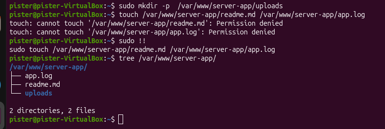
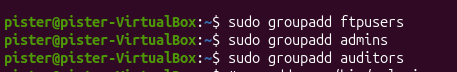
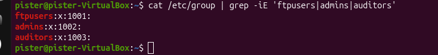
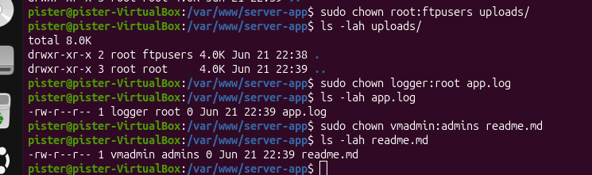
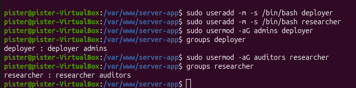
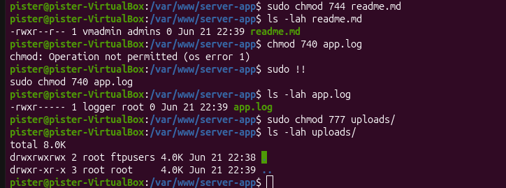

# <center>TMS</center>

## <center>Home Work #5</center>

## Задание 1 - Установить Mongo DB
1. Для установки пользовался командами:
 ``` bash
 sudo apt-get install gnupg curl
 curl -fsSL https://pgp.mongodb.com/server-7.0.asc |sudo gpg  --dearmor -o /etc/apt/trusted.gpg.d/mongodb-server-7.0.gpg
 echo "deb [ arch=amd64,arm64 ] https://repo.mongodb.org/apt/ubuntu jammy/mongodb-org/7.0 multiverse" | sudo tee /etc/apt/sources.list.d/mongodb-org-7.0.list
 sudo apt-get update
 sudo apt-get install -y mongodb-org
 ```
2. Cоздать таблицу data создать пользователя manager, у которого будет доступ
только на чтение этой таблицы.

- Создание таблицы `data` и пользователя `manager`
``` javascript
use mydb
db.data.insertOne({ name: "test", value: 1 })
db.createRole({
  role: "readData",
  privileges: [ { resource: { db: "mydb", collection: "data" }, actions: ["find"] } ],
  roles: []
})
db.createUser({
  user: "manager",
  pwd: "test321",
  roles: [ { role: "readData", db: "mydb" } ]
})
```

- Проверка прав пользователя `manager`

Подключаемся к MongoDB и проверяем:

``` javascript
> show collections
data
> db.getUser("manager")
{
	"_id" : "mydb.manager",
	"userId" : UUID("2d126f5d-54c1-431f-b661-f3d74d4d39f2"),
	"user" : "manager",
	"db" : "mydb",
	"roles" : [
		{
			"role" : "readData",
			"db" : "mydb"
		}
	],
	"mechanisms" : [
		"SCRAM-SHA-1",
		"SCRAM-SHA-256"
	]
}
```

## Доп задание

1. Создать директорию ``/var/www/server-app``; в ней файлы ``readme.md`` и ``app.log``; директорию ``uploads``

2. Создать:
- группу ``ftpusers``
- группу ``admins``
- группу ``auditors``



- Проверяю:

3. Создать 
- пользователя ``logger`` без возможности входа в систему
- пользователя ``vmadmin``
``` bash
pister@pister-VirtualBox:~$ sudo useradd -s /sbin/nologin logger
useradd: Warning: missing or non-executable shell '/bin/nologin'
pister@pister-VirtualBox:~$ sudo useradd -m -s /bin/bash vmadmin
```
Проверяю:
``` bash
pister@pister-VirtualBox:~$ cat /etc/passwd | grep -iE 'logger|vmadmin'
logger:x:1001:1004::/home/logger:/sbin/nologin
vmadmin:x:1002:1005::/home/vmadmin:/bin/bash
```
4. Назначить права:
- директория ``uploads``: владелец ``root``, группа - ``ftpusers``
- файл ``app.log``: владелец ``logger``, группа - ``root``
- файл ``readme.md``: владелец ``vmadmin``, группа - ``admins``



5. Создать пользователей ``deployer`` и ``researcher``
Добавить:
- пользователя ``deployer`` в группу ``admins``
- пользователя ``researcher`` в группу ``auditors``

6. Назначить режим доступа:
- файл ``readme.md``: владелец имеет все права; группа и остальные - только чтение
- файл ``app.log``: владелец имеет все права; - группа - только чтение; остальные - ничего
- директория ``uploads``: все категории имеют все права

